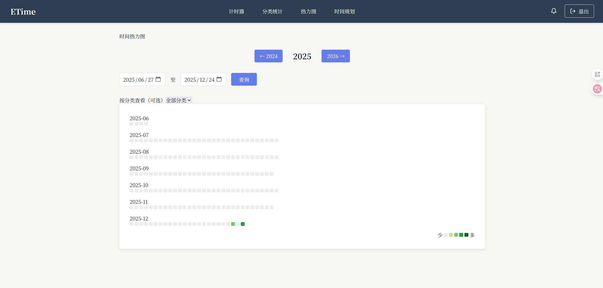
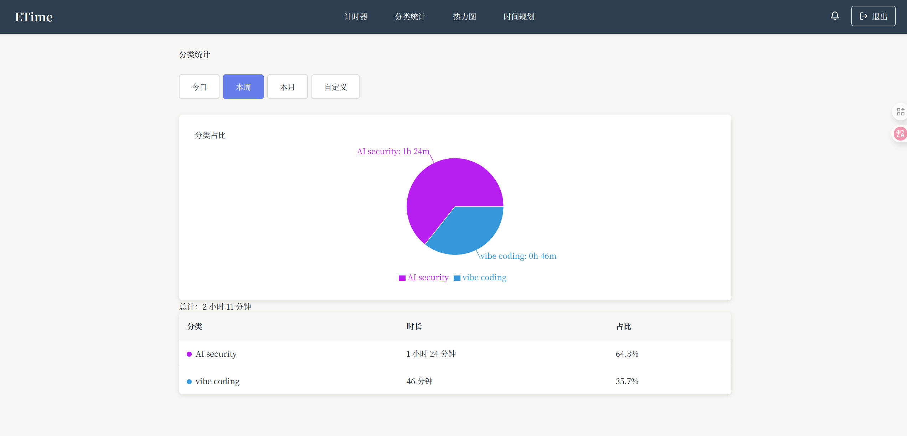
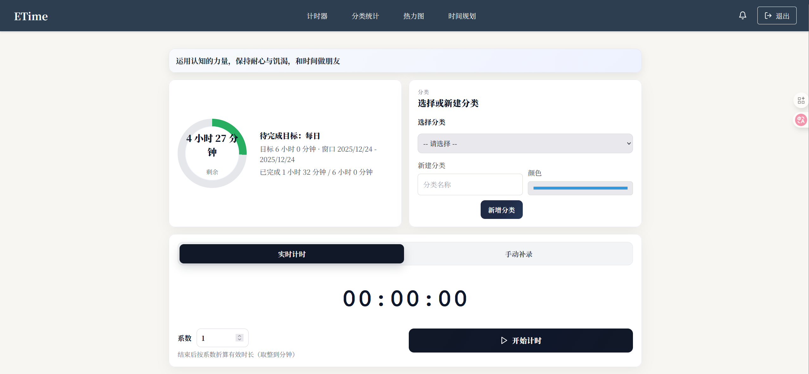

# ETime – 开源时间管理与目标跟踪

一个自托管的时间管理/目标跟踪工具，支持实时计时、手动补录、分类统计、目标进度提醒，前后端开源可自由部署。线上演示与自用地址：<http://time.lally.top>。

## 功能亮点
- 计时模式：实时计时与手动补录双模式，支持系数折算与取整。
- 目标进度：按日/周/月（含“明天”）显示目标窗口、剩余时长、已完成时长。
- 分类管理：分类选择与新建一体化卡片，对齐控件减少跳跃感。
- 统计视图：分类占比、热力图、目标达成等多视角复盘（前端已内置对应页面）。
- 开箱即用：Docker Compose 一键拉起前后端与 PostgreSQL。

## 技术栈
- 前端：React + Vite + TypeScript + Tailwind + Recharts
- 后端：FastAPI + SQLAlchemy + Alembic + PostgreSQL
- 其他：JWT 认证、Docker Compose、Nginx（前端容器）

## 在线体验
- 公网地址：<http://time.lally.top>

## 界面预览

## 部署（Docker Compose）

1) 依赖
- Docker、Docker Compose
- 可选：本机访问容器内 Postgres 可用 55432:5432 映射

2) 环境变量
- backend 目录创建 `.env`（可复制 `.env.example`）
- 默认数据库指向 Compose 内的 `db`；如需前端改代理，设置 `API_PROXY_TARGET`（默认 `http://backend:8001`）
 - 已完全使用 PostgreSQL，部署不需要也不会生成 SQLite 文件。

3) 启动
- `docker compose up -d --build`
- 首次或迁移变更：`docker compose run --rm backend alembic upgrade head`

4) 访问
- 后端 API: `http://localhost:8001/api/v1`
- 前端: `http://localhost:3000`（开发模式 Vite 代理 `/api` 到 backend）

5) 常用运维
- 重启：`docker compose restart backend frontend`
- 查库：`docker exec -it etime_db psql -U etime -d etime`（或 host 直连 `localhost:55432`）

## 本地开发
- 前端：`cd frontend && npm install && npm run dev -- --host --port 3000`
- 后端用例：`cd backend && pytest`（默认使用 env 中的 PostgreSQL；如需隔离，可自行设置临时数据库连接）
- 保持工作区干净，避免提交本地生成的数据库文件或测试缓存。
