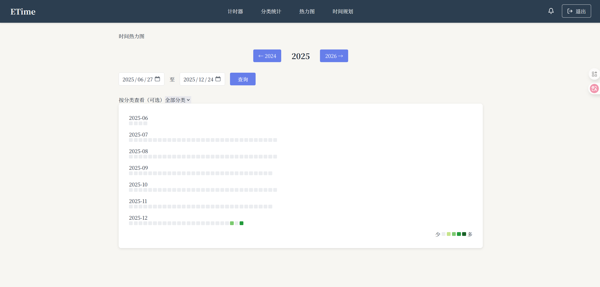
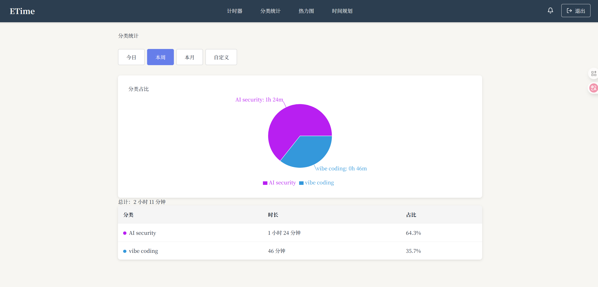
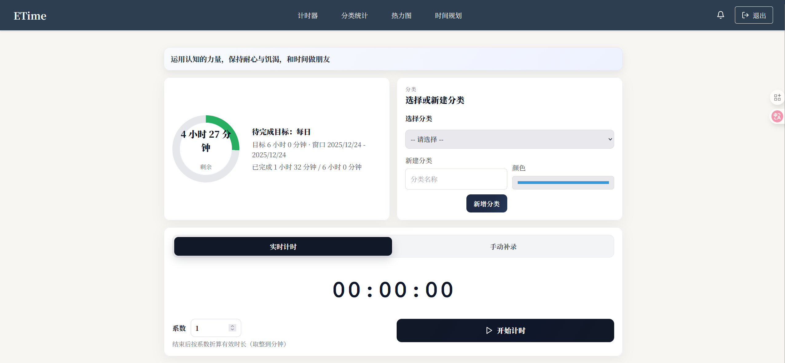

# ETime – 开源时间管理与目标跟踪

一个自托管的时间管理/目标跟踪工具，支持实时计时、手动补录、分类统计、目标进度提醒，前后端开源可自由部署。线上演示与自用地址：<http://time.lally.top>。

## 功能亮点
- 计时模式：实时计时与手动补录双模式，支持系数折算与取整；实时计时支持离线启动/停止、刷新恢复和联网后自动同步。
- 目标进度：按日/周/月（含“明天”）显示目标窗口、剩余时长、已完成时长。
- 目标引擎 2.0：支持连胜、最佳连胜、完成率、时间债务、补偿记录和惩罚/奖励可视化。
- 自动复盘：日报/周报串联统计、目标达成、分类趋势和时痕，并支持一键导出 Markdown。
- 分类管理：分类选择与新建一体化卡片，对齐控件减少跳跃感。
- 统计视图：分类占比、热力图、目标达成等多视角复盘（前端已内置对应页面）。
- 账号安全：JWT 登录、刷新令牌、邮箱密码重置；重置令牌会绑定当前密码状态，使用一次后自动失效。
- 安卓端：通过 Capacitor 复用现有前端，支持同步 Web 构建产物并生成 debug APK。
- 开箱即用：Docker Compose 一键拉起前后端与 PostgreSQL。

## 技术栈
- 前端：React + Vite + TypeScript + Tailwind + Recharts
- 后端：FastAPI + SQLAlchemy + Alembic + PostgreSQL
- 其他：JWT 认证、SMTP 邮件、Docker Compose、Nginx（前端容器）、Capacitor Android

## 在线体验
- 公网地址：<http://time.lally.top>

## 界面预览





## 部署（Docker Compose）

1) 依赖
- Docker、Docker Compose
- 可选：本机访问容器内 Postgres 可用 55432:5432 映射

2) 环境变量
- 在仓库根目录创建 `.env`，至少设置一个强随机数据库密码：

```env
POSTGRES_DB=etime
POSTGRES_USER=etime
POSTGRES_PASSWORD=replace-with-a-long-random-password
```

- backend 目录创建 `.env`（可复制 `.env.example`）
- 默认数据库指向 Compose 内的 `db`；如需前端改代理，设置 `API_PROXY_TARGET`（默认 `http://backend:8001`）
- 已完全使用 PostgreSQL，部署不需要也不会生成 SQLite 文件。
- 找回密码邮件需要配置 `SMTP_HOST`、`SMTP_USER`、`SMTP_PASSWORD` 等 SMTP 变量；未配置时接口仍返回通用提示，但后台日志会记录发送失败。
- 登录和找回密码默认启用轻量限流，可通过 `LOGIN_RATE_LIMIT_*` 和 `PASSWORD_RESET_RATE_LIMIT_*` 调整。
- 默认不会自动创建管理员账号。若确需本地种子管理员，必须显式设置 `AUTO_INIT_ADMIN=True` 和至少 12 位、非默认值的 `DEFAULT_ADMIN_PASSWORD`。

3) 启动
- `docker compose up -d --build`
- 首次或迁移变更：`docker compose run --rm backend alembic upgrade head`


4) 访问
- 后端 API: `http://localhost:8001/api/v1`
- 前端: `http://localhost:3000`（开发模式 Vite 代理 `/api` 到 backend）

5) 常用运维
- 重启：`docker compose restart backend frontend`
- 查库：`docker exec -it etime_db psql -U "$POSTGRES_USER" -d "$POSTGRES_DB"`
- PostgreSQL 默认只在 Compose 内网可用，不再映射到宿主机。需要临时直连时可手动添加本地端口映射，不建议生产环境暴露。

## 安全默认值

- 不内置可登录的默认管理员；`admin/admin123` 不会被自动创建。
- `docker-compose.yml` 不再使用默认数据库密码，也不默认暴露 PostgreSQL 端口。
- 前端退出登录会同时清理 access token 和 refresh token。
- Android Manifest 禁止应用备份和明文 HTTP 流量；自律模式密码使用 PBKDF2-HMAC-SHA256 派生存储。
- 运行时前端依赖已通过 `npm audit --omit=dev` 校验为 0 漏洞。

## 本地开发
- 前端：`cd frontend && npm install && npm run dev -- --host --port 3000`
- 后端用例：`cd backend && pytest`（默认使用 env 中的 PostgreSQL；如需隔离，可自行设置临时数据库连接）
- 保持工作区干净，避免提交本地生成的数据库文件或测试缓存。

## 安卓端

安卓端工程位于 `frontend/android`，使用 Capacitor 复用 `frontend/dist`。

常用命令：
- 同步 Web 构建产物到 Android：`cd frontend && npm run android:sync`
- 打开 Android Studio：`cd frontend && npm run android:open`
- 构建 debug APK：`cd frontend && npm run android:build:debug`

默认情况下，浏览器端和安卓端都使用构建产物中的 `/api/v1`。安卓端没有硬编码生产域名；打包到真实后端时，构建前显式设置 `VITE_API_BASE_URL` 或 `VITE_NATIVE_API_BASE_URL`：

```powershell
$env:VITE_API_BASE_URL = 'https://your-domain.example/api/v1'
npm run android:sync
```

实时计时的离线记录会保存在本地，包含 `local_timer_id`、分类、开始/结束时间、状态和来源（Web 为 `web`，Capacitor Android 为 `android`）。应用启动、进入计时页和浏览器/ WebView 恢复在线时都会尝试同步；后端使用 `client_generated_id` 做幂等去重，重复提交同一条本地记录不会创建重复 session。

debug APK 输出位置：

```text
frontend/android/app/build/outputs/apk/debug/app-debug.apk
```
