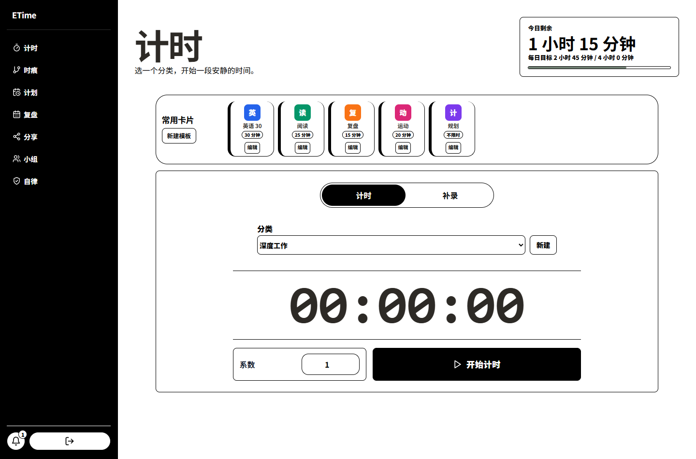
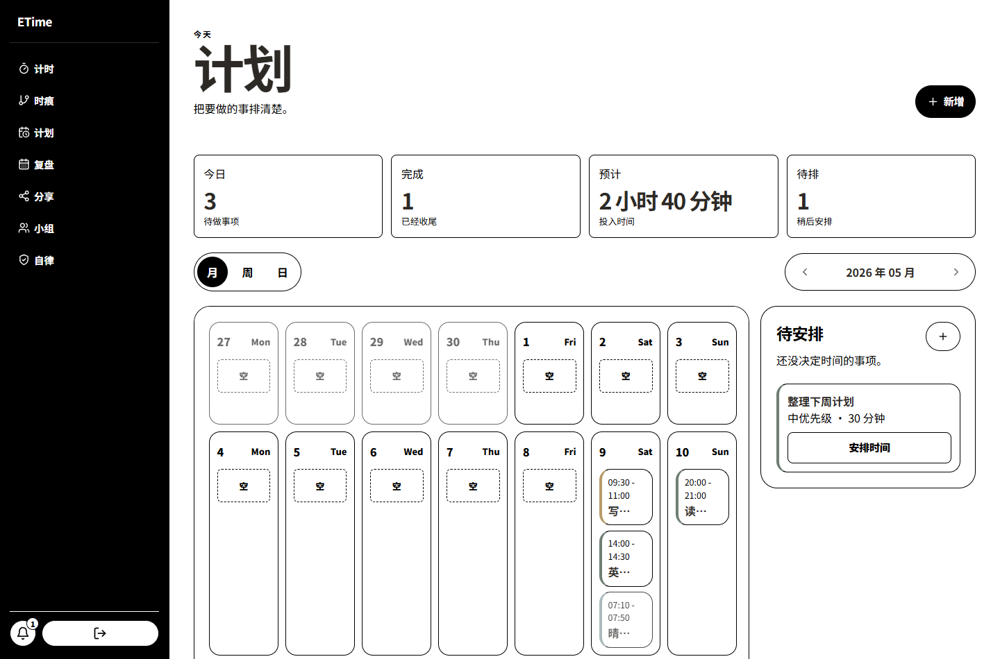
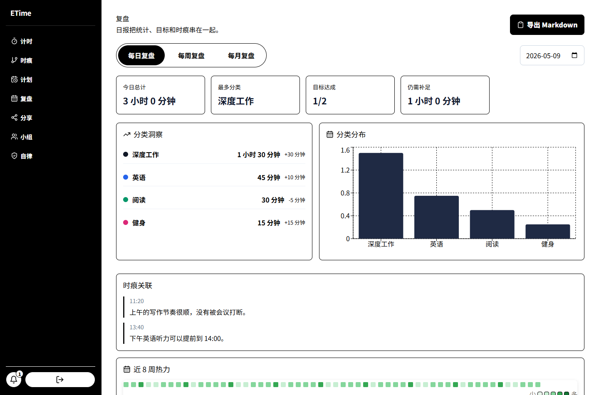
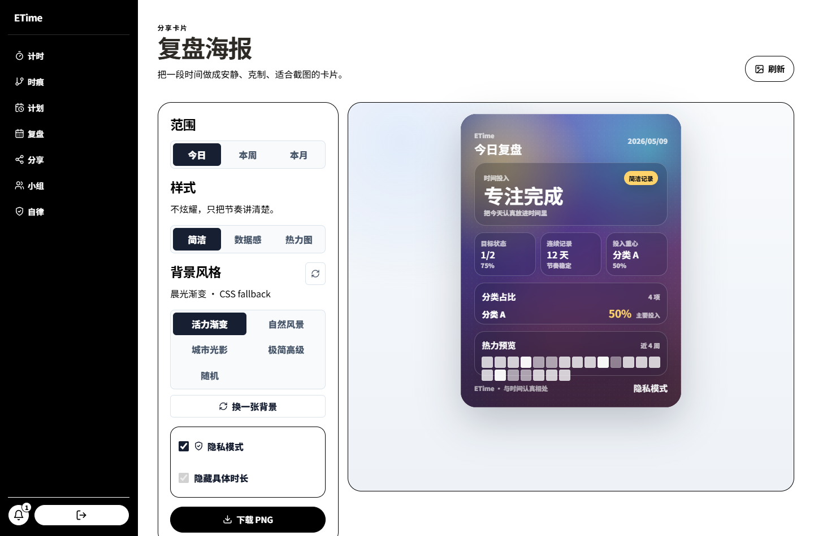
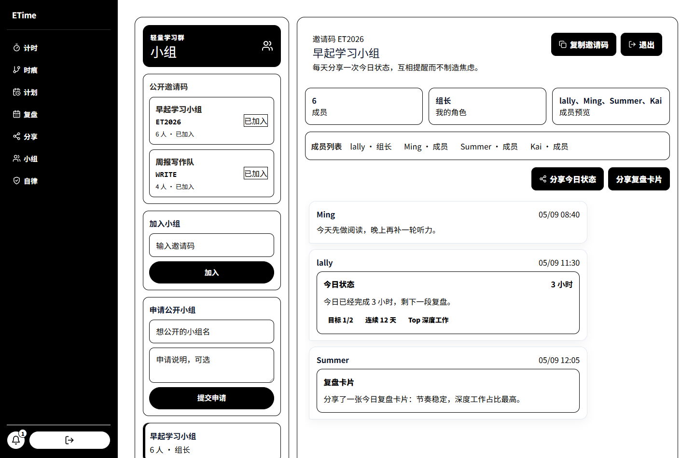
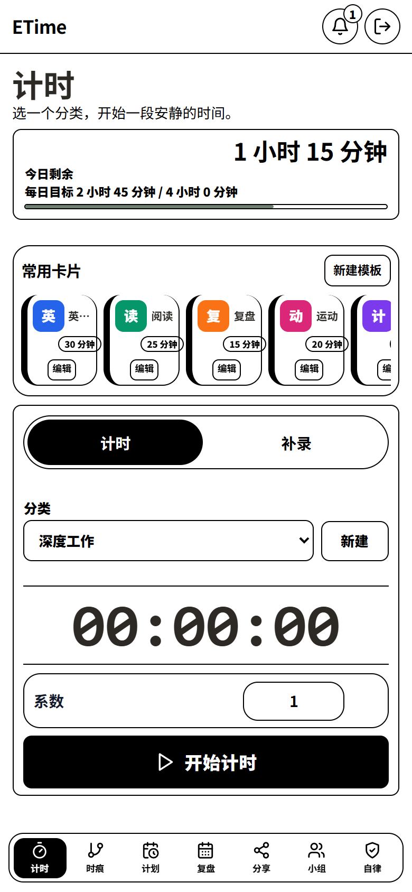
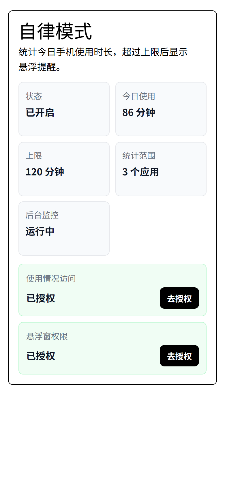

# 我做了一个开源时间工作台：ETime

如果你也试过很多时间管理工具，可能会遇到同一种疲惫：记录本身变成了另一件需要坚持的事。

ETime 想解决的不是“怎样把每一分钟都管起来”，而是更朴素的一件事：让开始更轻，让目标有反馈，让复盘能看见节奏。

项目地址：<https://github.com/0xlally/etime>  
在线体验：<http://time.lally.top>

## 它是什么

ETime 是一个自托管的时间管理、目标追踪与复盘工具。你可以把它当成个人时间工作台：

- 开始一段实时计时。
- 补录已经完成的时间。
- 把高频事项做成快捷卡片。
- 在日历里安排今天、本周或未来某天。
- 设置每日、每周、每月目标。
- 查看统计、热力图、目标进度和复盘报告。
- 生成适合分享的复盘海报。
- 和小组成员一起打卡、分享今日状态。
- 在 Android 上开启自律模式，统计手机使用并设置提醒上限。

它有 Web 端，也有基于 Capacitor 的 Android 端。后端是 FastAPI，数据放在 PostgreSQL，适合自托管，也适合二次开发。

## 为什么不是又一个秒表

普通秒表只记录“过去了多久”。但长期目标真正需要的是反馈：

- 今天离目标还差多少？
- 时间主要流向了哪些分类？
- 哪些任务反复拖延？
- 本周节奏是否稳定？
- 我能不能把复盘带走，沉淀成周报或分享卡片？

ETime 把这些问题放进同一条工作流里：计划要做什么，开始计时，补录遗漏，检查目标，最后复盘。

## 安静的黑白线条风格

新版本界面采用克制的黑白线条风格：白底、黑字、清晰边框，减少大面积装饰色块。这样打开应用时，注意力会先落在“现在要做什么”上，而不是被界面本身抢走。

但 ETime 没有把所有颜色都压成黑白。分类色点、快捷卡片、热力格和时痕时间线仍然保留颜色，因为它们不是装饰，而是帮助识别数据的信号。

## 一点就开始，而不是先配置半天

首页是计时工作台。它按真实使用顺序组织：

- 顶部显示今日剩余时长。
- 常用卡片放在计时器上方，一点就开始。
- 计时器主体保持足够大，分类选择、开始按钮和效率系数都在同一张主卡里。
- 补录不是另一个复杂入口，而是同一张卡里的第二种模式。

这适合那些每天会重复出现的事项：英语 30 分钟、阅读 25 分钟、复盘 15 分钟、运动 20 分钟。你不需要每次重新填写信息，只要点卡片即可。

## 允许生活不完美：离线与补录

很多时间记录最后失败，不是因为人不自律，而是因为真实生活总会打断流程。

ETime 支持：

- 离线开始/停止计时。
- 刷新或重开后恢复本地计时状态。
- 联网后自动同步待上传记录。
- 手动补录历史时间。
- 使用 `client_generated_id` 做幂等去重，减少重复同步导致的重复记录。

这让它更像一个能跟上现实节奏的工具，而不是只适合完美流程的表格。

## 目标不是口号，而是每天看得见的进度

ETime 的目标引擎支持每日、每周、每月和“明日”目标。你可以设置目标时长，也可以指定目标只统计某些分类。

目标会展示：

- 当前进度。
- 剩余时长。
- 连续达成和最佳连续。
- 完成率。
- 时间债务。
- 补偿建议。

这部分适合学习计划、备考计划、健身记录、自由职业工时管理，或者任何需要长期积累的事情。

## 计划：把任务放进时间里

ETime 不是完整项目管理软件，它更像轻量计划台。

月视图适合快速浏览这一段时间的安排；周视图和日视图保留更多操作，适合编辑、完成、转成时间记录，或者直接从计划开始计时。

待安排池用来收纳还没有日期的事项。你可以先把任务写下来，晚一点再安排到具体时间里。目标节奏也放在计划页里，方便一边安排任务，一边看今天、本周或本月还差多少投入。

## 复盘不是翻账，而是看见节奏

ETime 提供日报、周报、月报和热力预览：

- 分类占比告诉你时间去了哪里。
- 热力图告诉你节奏是否稳定。
- 日报/周报串联目标达成、分类趋势和时痕。
- Markdown 导出方便沉淀到博客、Notion、Obsidian 或周报里。

对于长期任务来说，复盘最大的价值不是审判自己，而是看见模式：什么时候状态好，什么事情总是拖延，哪类投入正在变多。

## 分享海报：把努力做成一张安静的卡片

ETime 可以生成今日、本周或本月复盘海报。

它会聚合：

- 总时长。
- 分类占比。
- 目标完成状态。
- 连续记录天数。
- 热力图预览。

隐私模式会隐藏真实分类名，也可以隐藏具体时长。Web 端可以导出 PNG，Android 端可以调用系统分享。

## 小组协作：轻量，但够用

ETime 的小组功能适合自习小组、学习搭子、备考打卡群、写作/开发结伴。

当前支持：

- 创建小组并生成邀请码。
- 通过邀请码加入。
- 公开小组申请。
- 成员列表。
- 文本消息。
- 分享今日状态。
- 分享复盘卡片摘要。

它不是为了制造排名压力，而是为了让长期投入有一点同伴感。

## Android：把同一套体验带到手机上

Android 端使用 Capacitor 复用前端体验，同时加入两个移动端重点能力：

- 离线计时队列：前台断网、刷新、切换后仍能恢复和同步。
- 自律模式：统计今日手机使用时长，超过上限后显示悬浮提醒。

自律模式可以设置每日上限、统计全部应用或指定应用。它需要 Android 的使用情况访问和悬浮窗权限，本地解锁密码使用 PBKDF2-HMAC-SHA256 派生存储。

## 技术实现

ETime 的技术栈比较直接：

- 前端：React、Vite、TypeScript、Tailwind CSS、Recharts。
- 后端：FastAPI、SQLAlchemy、Alembic。
- 数据库：PostgreSQL。
- 部署：Docker Compose、Nginx。
- 移动端：Capacitor Android。
- 认证：JWT access token + refresh token。
- 邮件：SMTP 找回密码。

安全默认值上做了几件事：

- 不内置可登录的默认管理员。
- Docker Compose 要求显式设置数据库密码。
- 后端日志脱敏数据库连接串。
- Docker 镜像不复制 `.env`。
- Android 禁止明文 HTTP 和应用备份。
- 自律模式本地密码使用 PBKDF2 派生存储。

## 适合谁

ETime 适合这些人：

- 想自托管数据，不想把长期记录放在封闭平台里。
- 想记录学习、工作、健身、写作或备考投入。
- 需要目标反馈，而不只是一个秒表。
- 想把复盘导出成 Markdown 或图片。
- 想和小组一起轻量打卡。
- 想基于 FastAPI + React 二次开发自己的时间系统。

## 推广文案

一句话版：

> ETime 是一个开源、自托管的时间工作台：计时、计划、目标、复盘、分享和小组协作，都放在一套安静清晰的系统里。

短介绍版：

> ETime 帮你把每天的投入记录下来，把长期目标拆成可见进度，并在复盘时生成清晰的统计、热力图和分享海报。它支持 Web 和 Android，前后端开源，可用 Docker Compose 自托管。新版本采用简洁黑白线条风格，同时保留分类、快捷卡片、热力图和时痕时间线的识别颜色。

发布帖版：

> 我做了一个开源时间工作台 ETime。它不是单纯秒表，而是把“开始计时 -> 安排计划 -> 跟踪目标 -> 复盘节奏 -> 分享结果”串成一条完整路径。你可以用它记录学习、工作、健身、写作或备考投入，也可以自托管自己的时间数据。Web 和 Android 都可用，Android 端还带自律模式，可以统计今日手机使用时长并设置悬浮提醒。

## 最后

我希望 ETime 是一种温和的工具：它不逼你变成机器，也不把自律做成焦虑。它只是尽量降低开始的阻力，把投入变得可见，把复盘变得轻一点。

如果你正在做一个长期目标，或者想拥有自己的时间数据，欢迎试试看。
